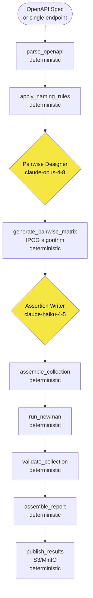

# Architecture & Technical Design
## API Test Generator — OpenAPI → Postman/Newman with Pairwise Combinatorics

---

## Problem

Off-the-shelf OpenAPI test generators produce boilerplate. They ignore naming
standards, combinatorial coverage strategy, assertion contracts, classification
taxonomy, and produce no analytics. The result: low-confidence tests that drift
from the spec and are expensive to maintain.

This agent solves it with a **deterministic-first pipeline** — LLM reasoning
only where combinatorial or linguistic judgement genuinely adds value.

---

## Pipeline



**Yellow** = LLM. Everything else is deterministic TypeScript.

---

## Three-Model Strategy

| Role | Model | Why this model | Cap |
|---|---|---|---|
| Orchestrator | `claude-sonnet-4-6` | Coordination only — reads spec, calls tools in sequence, writes summary | 30 steps |
| Pairwise Designer | `claude-opus-4-8` | Complex reasoning: infer testable factors, levels, constraints from business semantics. Runs **once** | 15 steps |
| Assertion Writer | `claude-haiku-4-5-20251001` | Bulk template-following generation of `pm.test()` blocks. Cheapest correct model | 20 steps |

The Pairwise Designer never computes combinations — it returns factor
definitions only. The IPOG algorithm (deterministic code) handles the math.

---

## Deterministic vs LLM Boundary

```
DETERMINISTIC (always same output for same input)
─────────────────────────────────────────────────
  parse_openapi          → endpoint_model.json
  apply_naming_rules     → named_endpoint_model.json
  generate_pairwise_matrix → matrix.json + .csv + .pict files
  assemble_collection    → collection + data + env + api_config + manifest
  run_newman             → newman_report.html/.json
  validate_collection    → validation_report.md
  assemble_report        → markdown reports + structured/*.jsonl/.json
  publish_results        → S3/MinIO upload

LLM (one call each, capped, no self-loop)
─────────────────────────────────────────
  Pairwise Designer  → factors_model.json
  Assertion Writer   → assertion_scripts.json + tsname_suggestions
```

> 95%+ of token budget is deterministic. LLM is used only for judgment
> that cannot be codified: factor selection, constraint discovery, and
> human-readable test names.

---

## PICT Model — The Combinatorial Core

Based on PICT (Pairwise Independent Combinatorial Testing). See:
[Applying Combinatorial Science & Discrete Mathematics to API Testing](https://www.linkedin.com/pulse/applying-combinatorial-science-discrete-mathematics-karuppaiah-qgste/)

```
PICT model = Parameters + Values + Constraints

  role:  admin, viewer, anonymous
  limit: null, 1, 50, 100, 101
  sort:  name, invalid_field

  IF [role] = "anonymous" THEN expect 401;   ← constraint block
  IF [limit] = "101"      THEN expect 400;   ← over-boundary constraint
```

**Key insight:** C(4,2) = 6 pairs covered per test row. A 1,400-row Cartesian
product reduces to 35–45 rows at ~97% pair coverage.

**The constraint block is the most valuable part most teams skip.** It encodes
domain knowledge — infeasible combinations, always-rejected roles, over-boundary
values — preventing impossible tests and surfacing assumptions explicitly.

Each endpoint emits a `.pict` file → version-control alongside the spec → CI
can regenerate the matrix when the model changes.

### Three-Layer Coverage Model

| Layer | What it tests | Key factors |
|---|---|---|
| 1 — Capability | CRUD + data variations | `role`, `resource_state`, enums, boundaries |
| 2 — Connectivity | Auth + connection mode | `auth_type`, `connection_mode` |
| 3 — Environment | Module × deployment | `module`, `env_type` |

Most endpoints live in Layer 1. Promote to Layers 2/3 only when the endpoint
behavior actually changes per connection mode or deployment target.

---

## Artifact Map

```
runs/<run-id>/
 ├── endpoint_model.json          parsed, normalized
 ├── named_endpoint_model.json    naming rules applied
 ├── factors_model.json           from Pairwise Designer
 ├── pairwise_matrix.json/.csv    IPOG output
 ├── pict_models/
 │   └── <operationId>.pict       one per endpoint — version-control this
 ├── assertion_scripts.json       from Assertion Writer
 │
 ├── <ApiName>_collection.json    ← test scripts (stable)
 ├── <ApiName>_data.json          ← iteration data (extend freely)
 ├── <ApiName>_environment.json   ← base URL, credentials (per environment)
 ├── api_config.json              ← runtime config for CI/CD
 ├── collection_data.yml          ← manifest registry
 ├── test_scripts/<Req>.js        ← extracted scripts for code review
 │
 ├── newman_report.html/.json     Newman execution results
 ├── validation_report.md         8 automated checks
 ├── coverage_report.md
 ├── gaps_report.md
 ├── report.md / summary.json
 │
 ├── structured/
 │   ├── test_results.jsonl       per-execution results — DuckDB queryable
 │   ├── coverage.json            run-level metrics
 │   ├── matrix.jsonl             matrix rows with factor values
 │   └── query_hints.sql          ready-to-use DuckDB examples
 │
 └── phases/
     ├── orchestrate.json
     ├── pairwise-designer.json
     ├── assertion-writer.json
     └── report.json
```

### Separation of Concerns

```
Test scripts  (HOW to assert)  → *_collection.json   — edit for assertion changes
Test data     (WHAT to test)   → *_data.json         — add rows freely, no collection change
Configuration (WHERE to run)   → api_config.json     — one file, no Postman files needed
```

---

## Structured Analytics — DuckDB

`assemble_report` joins the Newman execution report with the data file to
produce Hive-partitioned JSONL:

```
S3/MinIO bucket
└── api-tests/
    └── year=2026/month=06/day=28/
        └── api_name=PetStore/run_id=2026-06-28T10-00Z/
            └── structured/
                ├── test_results.jsonl   ← per request×iteration, with product/feature/capability
                ├── coverage.json        ← run metrics
                └── matrix.jsonl         ← factor values per row
```

```sql
-- DuckDB: failure hotspots across all CI runs
SELECT feature, capability, status, COUNT(*) AS n
FROM read_json_auto('s3://bucket/api-tests/**/test_results.jsonl',
                    hive_partitioning=true)
GROUP BY ALL ORDER BY n DESC;
```

`hive_partitioning=true` lets DuckDB prune by `year`, `month`, `day`, `api_name`
before scanning files. No ETL pipeline needed.

---

## Assertion Contract

Every generated request carries exactly **three** `pm.test()` blocks, data-driven
from `pm.iterationData.get(...)`:

```
Block 1 → Status code          pm.response.to.have.status(parseInt(respCode))
Block 2 → Content-Type header  compare base MIME type (strips charset)
Block 3 → Response body        four branches: 4xx/HTML · JSON · XML · fallback
```

No expected values are hard-coded in scripts. Every value comes from the data
file via `responseCodeFor<Suffix>`, `responseTextFor<Suffix>`,
`contentTypeFor<Suffix>`. This is what makes test data independently extensible.

---

## Validation Gates

`validate_collection` enforces eight rules before results are reported:

| # | Rule | Severity |
|---|---|---|
| 1 | Collection file ends in `_collection.json` | ERROR |
| 2 | `info.name` matches filename | WARN |
| 3 | Every request has all 3 `pm.test()` blocks | ERROR |
| 4 | `responseCodeFor<Suffix>` referenced in script | ERROR |
| 5 | No hard-coded URLs in scripts | ERROR |
| 6 | Endpoint coverage vs parsed spec | WARN |
| 7 | Classification fields present in every data row | ERROR |
| 8 | No credentials in collection JSON | ERROR |

---

## Security & Credential Hygiene

- Zero credentials in collection JSON — only `{{variable}}` placeholders
- Auth values resolve from Postman environment or `ENV_*` prefixed host env vars
- Dynamic tokens captured via `pm.collectionVariables.set()` — not in data file
- `validate_collection` rule 8 scans for hard-coded credential patterns and fails the run

---

## Input Flexibility

```
Full spec:            Any OpenAPI 3.x YAML or JSON (local file or URL)
Single endpoint:      Full spec, but instruct the orchestrator:
                      "Generate tests for GET /pets only"
                      The Pairwise Designer receives the full model but
                      analyzes only the specified operationId(s).
Multi-endpoint:       Default — all endpoints in the spec
URL-based spec:       curl-fetched automatically into the sandbox
```
