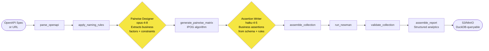

# From OpenAPI Spec to Business-Verified API Tests: How the Agent Works

Reads an OpenAPI 3.x specification, extracts business rules and parameter semantics,
generates a minimum pairwise matrix, and produces data-driven Postman collections
ready for Newman execution. Test **authoring** (LLM-involved, run once when the spec
changes) and test **execution** (deterministic, CI/CD or on-demand) are strictly
separated phases — execution never touches an LLM.

---

## Two Phases: Authoring vs Execution

```
┌─────────────────────────────────────────────────────────────────────────┐
│  PHASE 1 — TEST AUTHORING  (Eve agent, LLM-involved, run once)         │
│                                                                         │
│  Input:  OpenAPI spec + options                                         │
│  Steps:  parse → name → pairwise design → IPOG → assertions → assemble │
│  Output: *_collection.json  *_data.json  *_environment.json             │
│          api_config.json  pict_models/  test_scripts/                   │
│                                                                         │
│  When to re-run: spec changes, new endpoints, assertion contract update │
└─────────────────────────────────────────────────────────────────────────┘
                        │  commit artifacts to VCS
                        ▼
┌─────────────────────────────────────────────────────────────────────────┐
│  PHASE 2 — TEST EXECUTION  (no LLM, CI/CD or on-demand trigger)        │
│                                                                         │
│  Input:  Authoring artifacts + test_data_config.json + env vars        │
│  Steps:  1. Data setup — query JDBC/Object Store → inject real IDs     │
│          2. Newman run — collection + live data file                    │
│          3. Structured JSONL assembly                                   │
│          4. Publish to S3/MinIO data lake                              │
│  Output: test_results.jsonl  coverage.json → DuckDB queryable          │
│                                                                         │
│  Trigger: GitHub Actions (push/PR/on-demand), local npm run execute    │
└─────────────────────────────────────────────────────────────────────────┘
```

**Why the split matters:** Re-running tests in CI does not re-invoke LLMs. Authoring
artifacts are committed to VCS and consumed by the execution runner as-is. The
collection never changes between CI runs unless the spec changes.

---

## The Two Layers of Test Coverage

Most API test generators stop at layer one. This agent covers both.

```
Layer 1 — Structural / HTTP mechanics       Layer 2 — Business functionality
────────────────────────────────────────    ────────────────────────────────────────
Did the server respond?                     Did it respond with the RIGHT data?
Is the status code correct?                 Does filtering by status=available
Is the Content-Type header set?               return ONLY available pets?
Does the body parse as JSON?                Does limit=5 produce ≤ 5 items?
Does a 401 come back for anonymous?         Does POST { name: "Fido" } echo
Does the schema contain required fields?      name: "Fido" in the response?
Does DELETE return 404 on re-fetch?         Does sort=name produce alpha order?
```

**Layer 2 tests are derived directly from the OpenAPI spec.** Parameter
descriptions, response schema definitions, enum values, examples, and
`description` fields carry the business contract. The Pairwise Designer reads
all of it and encodes the business rules as factors, constraints, and
must-include rows.

---

## How Business Rules Flow Through the Pipeline

```
OpenAPI spec fragment
─────────────────────────────────────────────────────
  GET /pets
    parameters:
      status: { enum: [available, pending, sold] }
      limit:  { type: integer, minimum: 1, maximum: 100 }
    responses:
      200:
        schema:
          type: array
          items: { required: [id, name, status] }
          description: "Returns only pets matching the requested status"

          ↓  Pairwise Designer reads this

factors extracted
─────────────────────────────────────────────────────
  status: [available, pending, sold, null(omit)]
  limit:  [null, 1, 50, 100, 101]
  role:   [admin, viewer, anonymous]

  constraints:
    IF role = anonymous    → expect 401  (auth rule)
    IF limit = 101         → expect 400  (boundary rule)
    IF status = available  → all response items must have status="available"
                                         (business rule — filter correctness)

          ↓  Assertion Writer reads schema + constraints

assertions generated per row
─────────────────────────────────────────────────────
  pm.test("Status code")               ← structural
  pm.test("Content-Type header")       ← structural
  pm.test("Response body validation")  ← structural

  pm.test("Filter correctness: all items match requested status")  ← business
  pm.test("Pagination: response length ≤ limit")                   ← business
  pm.test("Schema: id is positive integer on each item")           ← business
  pm.test("Schema: status is a declared enum value")               ← business

          ↓  Data file carries the mapping

data row (business-validated)
─────────────────────────────────────────────────────
  {
    "TSName":                  "List pets WITH status=available · expect 200 + only available items",
    "status":                  "available",
    "limit":                   "10",
    "responseCodeForListPets": 200,
    "responseTextForListPets": "available",
    "contentTypeForListPets":  "application/json",
    "expectFilterField":       "status",
    "expectFilterValue":       "available",
    "expectMaxItems":          "10"
  }
```

---

## Pipeline



LLM is used only where the spec requires reading and reasoning — everything else is deterministic TypeScript.

---

## Three-Model Strategy

| Role | Model | What it reads | What it produces |
|---|---|---|---|
| Orchestrator | `claude-sonnet-4-6` | User prompt + tool outputs | Sequenced tool calls, final summary |
| Pairwise Designer | `claude-opus-4-8` | Full endpoint model — params, descriptions, schemas, examples | `factors_model.json`: factors, levels, **business constraints**, must-include rows |
| Assertion Writer | `claude-haiku-4-5-20251001` | Named model + sample rows + response schemas | `assertion_scripts.json`: 3 structural blocks + N business assertion blocks per request |

The Pairwise Designer runs **once** and never computes combinations.
The IPOG tool handles the combinatorial math deterministically.

---

## What the Pairwise Designer Reads from the Spec

```
parameters[].description  → business rule in natural language
  "Filter results by status" → factor: status; constraint: response items must match
  "Maximum items to return"  → factor: limit; constraint: response.length ≤ limit

parameters[].enum          → all enum values are factor levels
  status: [available, pending, sold] → test each value, assert response reflects it

parameters[].minimum/maximum → boundary levels auto-derived
  limit: min=1, max=100 → levels: [null, 1, 50, 99, 100, 101]

responses[200].schema.required → required fields checked on every success row
  required: [id, name, status] → assert all three present on every item

responses[200].schema.properties[].enum → response enum checked against spec
  status.enum → assert response.status ∈ ["available","pending","sold"]

responses[].examples → expected body substrings inferred
  example: { id: 42, name: "Fido" } → responseTextFor<Suffix>: "Fido"

description/summary → cross-endpoint workflow hints
  "Creates a pet. Returns the pet with an assigned id." →
    POST 201: assert id is a positive integer
    follow-up GET /pets/{id}: should return the same pet
```

---

## What the Assertion Writer Generates

Beyond the mandatory 3-block contract, the Assertion Writer adds endpoint-specific
business assertions derived from the schema and constraints:

```javascript
// Always present (structural):
pm.test("Status code", ...)
pm.test("Content-Type header validation", ...)
pm.test("Response body validation", ...)  // 4 branches: HTML / JSON / XML / fallback

// Added for collection GET endpoints (business — from description):
pm.test("Filter correctness: all items match requested status", function () {
  var expectedStatus = pm.iterationData.get("expectFilterValue");
  if (!expectedStatus || pm.response.code !== 200) return;
  pm.response.json().forEach(function (item) {
    pm.expect(item.status).to.eql(expectedStatus);
  });
});

pm.test("Pagination: response length respects limit", function () {
  var maxItems = pm.iterationData.get("expectMaxItems");
  if (!maxItems || pm.response.code !== 200) return;
  pm.expect(pm.response.json()).to.have.length.at.most(parseInt(maxItems));
});

// Added for creation endpoints (business — from response schema):
pm.test("Schema: id is a positive integer", function () {
  if (pm.response.code === 201) {
    pm.expect(pm.response.json().id).to.be.a("number").above(0);
  }
});

// Added for update endpoints (business — input echoed in response):
pm.test("Response echoes updated name", function () {
  var sentName = pm.iterationData.get("name");
  if (sentName && pm.response.code === 200) {
    pm.expect(pm.response.json().name).to.eql(sentName);
  }
});
```

All dynamic values (`expectFilterValue`, `expectMaxItems`, `name`) come from the
data file — no hard-coded values in scripts.

---

## Deterministic vs LLM Boundary

```
DETERMINISTIC
  parse_openapi          → endpoint_model.json
  apply_naming_rules     → names, suffixes, folder map
  generate_pairwise_matrix → matrix + CSV + .pict files
  assemble_collection    → collection, data, env, api_config, manifest, test_scripts/
  run_newman             → newman_report.html/.json
  validate_collection    → 8 quality gates
  assemble_report        → markdown reports + structured/*.jsonl/.json
  publish_results        → S3/MinIO Hive-partitioned upload

LLM — one call each, step-capped, no self-loop
  Pairwise Designer  → business factors, constraints, must-include rows
  Assertion Writer   → structural + business pm.test() scripts, TSName labels
```

---

## PICT Model — The Combinatorial Core

Ref: [Applying Combinatorial Science & Discrete Mathematics to API Testing](https://www.linkedin.com/pulse/applying-combinatorial-science-discrete-mathematics-karuppaiah-qgste/)

```
PICT model = Parameters + Values + Constraints

  status: available, pending, sold, null
  limit:  null, 1, 50, 100, 101
  role:   admin, viewer, anonymous

  IF [role] = "anonymous"          → expect 401              (auth rule)
  IF [limit] = "101"               → expect 400              (boundary rule)
  IF [status] = "available", [role] <> "anonymous"
                                   → assert all items.status = "available"  (business rule)
```

C(4,2)=6 pairs covered per row. A 1,400-row Cartesian product → 35–45 rows at ~97% pair coverage.

**The constraint block is the most valuable part.** It encodes business knowledge:
infeasible combinations, always-rejected roles, filtering invariants, boundary
violations. Teams that skip constraints get mechanical tests — tests that verify
HTTP codes but miss the question "did the filter actually filter?"

Each endpoint emits a `.pict` file. Version-control these alongside your spec.
CI can regenerate the matrix when the model changes.

---

## Artifact Map

```
runs/<run-id>/
 ├── endpoint_model.json        parsed, normalized — params, schemas, descriptions
 ├── factors_model.json         business factors + constraints (Pairwise Designer)
 ├── pairwise_matrix.json/.csv  IPOG output — minimum covering matrix
 ├── pict_models/<opId>.pict    human-readable factor model — commit to VCS
 ├── assertion_scripts.json     business + structural assertions (Assertion Writer)
 │
 ├── <ApiName>_collection.json  test scripts — stable (only change for assertion fixes)
 ├── <ApiName>_data.json        iteration data — extend freely, no collection change
 ├── <ApiName>_environment.json base URL, auth — update per environment
 ├── api_config.json            runtime config for CI/CD pipelines
 ├── collection_data.yml        manifest registry
 ├── test_scripts/<Req>.js      extracted scripts for code review
 │
 ├── newman_report.html/.json   execution results
 ├── validation_report.md       8 automated quality gates
 ├── coverage_report.md / gaps_report.md / report.md / summary.json
 │
 └── structured/
     ├── test_results.jsonl     one row per request×iteration — DuckDB queryable
     ├── coverage.json          run-level metrics
     ├── matrix.jsonl           matrix rows with factor values
     └── query_hints.sql        ready-to-run DuckDB examples
```

---

## Structured Analytics

`assemble_report` joins Newman execution details with the data file to produce
Hive-partitioned output for direct DuckDB querying:

```
s3://bucket/api-tests/year=2026/month=06/day=28/api_name=PetStore/run_id=.../
  structured/test_results.jsonl
```

```sql
-- Business regression: did filter correctness break?
SELECT ts_name, assertion_errors
FROM read_json_auto('s3://bucket/api-tests/**/test_results.jsonl',
                    hive_partitioning=true)
WHERE status = 'failed'
  AND ts_name LIKE '%filter%';
```

---

## Test Data Strategy

Three types of test data, each with a different source:

```
Type A — Structural parameters (pairwise factor levels)
  Source: IPOG algorithm from Pairwise Designer output
  Examples: status=available, limit=50, role=admin
  When: generated during authoring → lives in *_data.json

Type B — Resource IDs (domain-specific keys)
  Source: test environment — JDBC or Object Store query
  Examples: patientId=UUID-001, encounterId=ENC-456, orgId=ORG-007
  When: resolved at execution start → injected into data rows before Newman

Type C — Fixture/seed data (pre-loaded reference records)
  Source: data generator (e.g. Synthea for healthcare, custom generators)
  Examples: Patient records, Encounter records, Claims
  When: one-time setup of the test environment
```

**`test_data_config.json`** — provided once by the developer (not generated by
the agent). Describes the data model and where to find real IDs:

```json
{
  "model_name": "H360 Healthcare 360 (Synthetic)",
  "datasources": {
    "h360_db": {
      "type": "jdbc",
      "driver": "postgresql",
      "host": "${H360_DB_HOST}",
      "database": "h360",
      "schema": "clinical"
    },
    "h360_lake": {
      "type": "object_store",
      "uri": "${H360_LAKE_URI}",
      "format": "parquet"
    }
  },
  "data_injection": {
    "patientId":   { "datasource": "h360_db",   "query": "SELECT patient_id FROM clinical.patients WHERE active=true LIMIT 20" },
    "encounterId": { "datasource": "h360_db",   "query": "SELECT encounter_id FROM clinical.encounters WHERE status='finished' LIMIT 10" },
    "orgId":       { "datasource": "h360_lake", "query": "SELECT org_id FROM read_parquet('${H360_LAKE_URI}/organizations/*.parquet') LIMIT 5" }
  }
}
```

During execution, DuckDB runs these queries (JDBC extension for databases, native
S3 for object store), collects the values, and patches the data file row-by-row
before Newman starts. Rows referencing `patientId` get one of the returned UUIDs.

The Pairwise Designer is aware that these entities exist (from the API spec's
path parameters and descriptions), so it generates factor levels using sensible
placeholder values like `"{{patientId}}"` rather than `"123"`.

---

## Execution Runner

The execution phase runs as a standalone script — no Eve, no LLM:

```
npm run execute --api PetStore --env staging
  │
  ├─ 1. Read api_config.json → locate collection + data + environment files
  ├─ 2. If test_data_config.json exists → run data setup (DuckDB queries)
  │      → write data_live.json with real IDs injected
  ├─ 3. Run Newman → newman_report.json
  ├─ 4. Postprocess Newman output → structured/test_results.jsonl
  │      + structured/coverage.json
  ├─ 5. If PUBLISH_S3_URI set → aws s3 sync → data lake
  └─ 6. Exit with Newman's exit code → CI pass/fail gate
```

GitHub Actions: `.github/workflows/api-tests.yml` — trigger on push to
collection artifact paths, or `workflow_dispatch` for on-demand execution with
inputs for `api_name`, `environment`, `run_id`.

---

## Validation Gates (8 rules, automated)

| # | Gate | What it catches |
|---|---|---|
| 1 | Collection filename ends in `_collection.json` | Naming drift |
| 2 | `info.name` matches filename | Mismatched collection identity |
| 3 | Every request has all 3 structural `pm.test()` blocks | Missing assertion |
| 4 | `responseCodeFor<Suffix>` referenced in script | Dead assertion key |
| 5 | No hard-coded URLs in scripts | Environment leak |
| 6 | Endpoint coverage vs parsed spec | Missed endpoints |
| 7 | `product`, `feature`, `capability` on every data row | Classification gap |
| 8 | No credentials in collection JSON | Credential leak |
