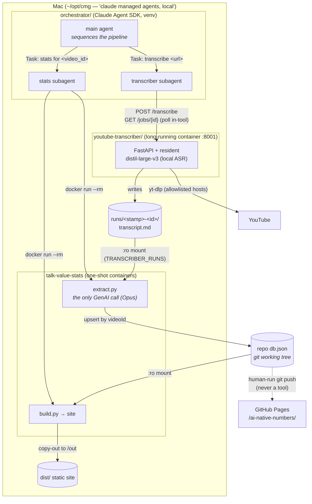
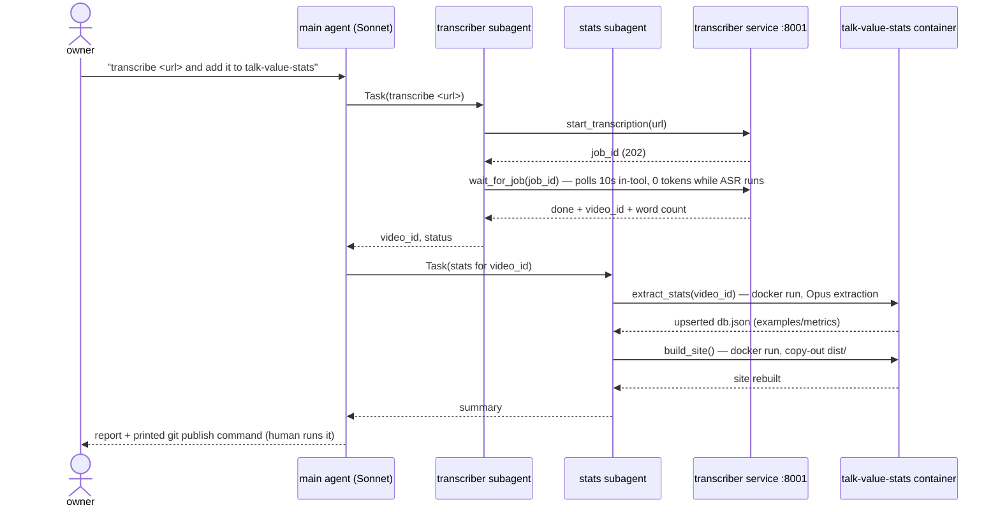

# cmg-orchestrator

The A2A layer of the `~/opt/cmg` local deployment: a small Python
[Claude Agent SDK](https://code.claude.com/docs/en/agent-sdk/python) app where
one natural-language prompt drives the whole pipeline —

```
"transcribe <any YouTube url or 11-char id> and add it to talk-value-stats"
```

— through two locally *deployed* agents:

1. a `transcriber` subagent calling the youtube-transcriber REST service
   (`$TRANSCRIBER_URL`, Docker, resident ASR model), and
2. a `stats` subagent invoking one-shot `talk-value-stats` containers
   (extract → `db.json` upsert in the git working tree → site rebuild).

Fully parameterized: nothing video-specific is hard-coded anywhere. The
transcript itself never crosses the agent boundary — it flows through the
shared `~/opt/cmg/youtube-transcriber/runs/` mount; agents exchange only ids
and statuses.

## Architecture



Only the 11-char `video_id` crosses the agent boundary — the transcript
itself moves through the shared `runs/` mount (the filesystem is the A2A
data plane; the orchestrator is the control plane).



## Design (see `openspec/changes/add-cmg-local-deploy/`)

- `core.py` — SDK-free: settings, 11-char id validation, the exact
  `docker run` argv builders, the in-tool poll loop (10 s / 90 min). This is
  the source of truth for the commands; `infra/cmg/run-*.sh` mirror them.
- `orchestrator.py` — SDK wiring: four in-process MCP tools
  (`start_transcription`, `wait_for_job`, `extract_stats`, `build_site`), two
  `AgentDefinition` subagents, strict tool allowlist (`Task` + the four
  tools; `Bash`/`Write`/`Edit`/web disallowed), and the CLI entry point.
- **Publish stays human**: the run ends by printing the
  `git add db.json … push` command; the orchestrator cannot execute git.
- Polling happens *inside* `wait_for_job` — the model consumes no tokens
  while ASR runs.

## Config (env, loaded from `~/opt/cmg/orchestrator/.env` by `run.sh`)

| var | meaning |
|---|---|
| `MODEL_CMG_ORCHESTRATOR` → `MODEL` → error | orchestrator model (repo rule: no default) |
| `ANTHROPIC_API_KEY` | for the SDK |
| `TRANSCRIBER_URL` | e.g. `http://localhost:8001` |
| `CMG_ROOT` | default `~/opt/cmg` |
| `REPO` | monorepo path (for the `db.json` bind mount) |
| `STATS_IMAGE` | default `ghcr.io/senthilsweb/talk-value-stats:latest` |

## Run

Deployed (normal): `~/opt/cmg/orchestrator/run.sh "transcribe … and add it to talk-value-stats"`

From the repo (dev): `cd agents/cmg-orchestrator && .venv/bin/pip install -e ".[dev]" && .venv/bin/cmg-orchestrator "…"`

Tests (no network, no docker, no key, no SDK import):
`.venv/bin/python -m pytest -q`

Prerequisites: Docker (the deployed services/images), Node 18+ (the SDK
drives the Claude Code runtime), Python ≥3.10.
