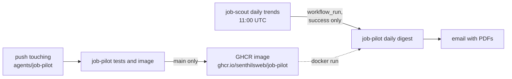

# CI/CD

At the end you will know how the two workflows chain off the daily
data publish, and the one privacy rule they must never break.

## job-pilot daily digest (`.github/workflows/job-pilot.yml`)

Triggered by the successful completion of "job-scout daily trends" —
this guarantees the fresh parquet is on `main` before the pipeline
reads it — plus manual dispatch with an optional baseline input.

Steps: resolve the baseline tag (the date of this workflow's own last
successful run, from the GitHub API; yesterday's tag on the first run
ever) → `docker run` the published image with all secrets as
environment variables.

**The privacy rule: this workflow uploads no artifacts.** On a public
repository, workflow artifacts are downloadable by anyone. Job
description text, match results, and cover letters exist only on the
runner and in the sent email. Logs carry counts and error reasons only.

## job-pilot tests and image (`.github/workflows/job-pilot-image.yml`)

On every push touching `agents/job-pilot/` (or job-scout's
`config.yaml`, which the pipeline reads): run the pytest suite — no
secrets, no network. On `main`, additionally rebuild and push the
Docker image. The image is `python:3.12-slim` with pure-Python
dependencies only; nothing apt-installed.

## Docs

This wiki is built by the shared `job-scout docs` workflow (MkDocs
Material + monorepo plugin) and deployed to GitHub Pages on pushes that
touch any agent's `docs/`.

Next: [FAQ](faq.md)
