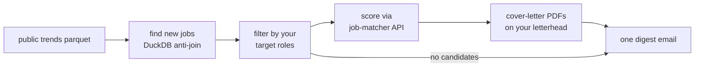

# job-pilot

One email a day about new jobs that fit you — with ready-to-send cover
letters attached.

Every morning, [job-scout](../job-scout/index.md) publishes a public
parquet snapshot of open jobs at ~95 technology companies. job-pilot
runs right after that publish. It finds the jobs that are **new since
its last run** and match your target roles, sends only those to the
deployed job-matcher API for scoring, renders cover-letter PDFs on your
personal letterhead for the good matches, and emails you one digest.

## The daily flow

A quiet day still sends a short email. Silence always means the
pipeline is broken, never that there was nothing.

## Three ideas the design stands on

- **Stateless.** There is no database. DuckDB (in memory) compares two
  public parquet URLs — today's file against the dated tag of the last
  successful run. Each job is analyzed exactly once by construction.
- **No LLM inside.** All model calls happen in the deployed job-matcher
  API. job-pilot itself is deterministic code, so its tests are plain
  pytest — 42 of them, no network, no secrets.
- **Bounded cost.** Paid calls need `RUN_PAID_MATCH=1`, and a run stops
  before the first paid call if the day's delta exceeds
  `max_jobs_per_run` (25).

It is a LangGraph pipeline. The graph is not decoration: version 2 adds
human-in-the-loop approval for outreach messages, which plugs into
LangGraph's checkpointer without a rewrite (see
[ADR 0003](https://github.com/senthilsweb/ai-agents/blob/main/openspec/adr/0003-langgraph-for-python-orchestration.md)).

Next: [Getting Started](getting-started.md)
