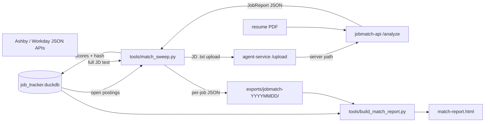

# API match pipeline — reference

How job-scout scores every open posting against a resume using the
deployed [agent-job-matcher](https://github.com/senthilsweb/agent-job-matcher)
API, and turns the results into a ranked HTML report.

Spec: [`openspec/changes/api-match-report/`](../openspec/changes/api-match-report/)
(proposal, design decisions D1–D8, per-capability specs). This page is
the day-to-day reference; the spec is the source of truth.

## The picture

Why the upload hop: job pages on Ashby and Workday are JavaScript
shells, so the API's URL fetcher rejects them (its word-count guard is
correct to do so). The sweep gets the real JD text from the ATS JSON
APIs and hands it to the API as an uploaded file instead. The
agent-service and the API share one `uploads` volume, so the path that
`/upload` returns is readable by `/analyze`.

## Tools

### `tools/match_sweep.py` — analyze new/changed postings

    python3 tools/match_sweep.py               # the real run
    python3 tools/match_sweep.py --dry-run     # selection only, zero API calls
    python3 tools/match_sweep.py --backfill exports/jobmatch-20260713/all_reports.json

| Flag | Meaning |
|---|---|
| *(none)* | Harvest JDs for all open postings, analyze the new/changed ones |
| `--dry-run` | Log `harvested / unharvestable / selected` counts and stop |
| `--backfill <json>` | Seed `api_match_result` from an existing enriched result file. Zero API calls. The analyzed date comes from the run directory name (`jobmatch-YYYYMMDD`) |

Selection rule (never pay twice): a posting is analyzed only when it is
`status='open'` **and** it has no `api_match_result` row **or** the
SHA-256 of its freshly harvested JD text differs from the stored hash.
Running the sweep twice in a row selects zero jobs the second time.

Outputs per run, under `exports/jobmatch-YYYYMMDD/`:

- `jd/*.txt` — the exact JD text that was scored (postings disappear
  from ATS boards when they close; this copy is permanent)
- `reports/*.json` — one `JobReport` per job, written as soon as its
  batch returns (an interrupted sweep resumes without re-paying)

Exit code: `0` when nothing failed, `1` when any job failed.

### `tools/build_match_report.py` — render any results JSON

    python3 tools/build_match_report.py \
        --input exports/jobmatch-20260713/all_reports.json \
        --out /tmp/report.html \
        [--title "My Report"] [--new-on 2026-07-13]

Works for any number of records (tested with 1 and 87). The input is a
JSON list; each element is either:

- **enriched** (what the sweep and `--backfill` write): job-scout
  metadata (`job_id`, `company`, `title`, `location`, `apply_url`,
  `file`, optional `first_analyzed`) plus `report` — one `JobReport`
  or `JobFetchFailure` exactly as the API returned it; or
- **raw**: a bare `/analyze` response array. Titles then come from
  `analysis.job_title` and there are no apply links.

The output is one self-contained HTML file: ranked by total score,
filterable by company and match band, light/dark themes, each row
expandable to strengths / gaps / resume improvements / missing ATS
keywords, with the **full cover letter collapsed inside each row**
(with a Copy button). Failures render in a "not analyzed" section.
`--new-on <date>` puts a NEW badge on entries whose `first_analyzed`
equals that date.

Look and feel live in `templates/match_report.html.j2` — restyling
never touches Python.

### `tools/daily_match.py` — the whole pipeline, one command

    python3 tools/daily_match.py [--skip-fetch] [--notify none]

Runs fetch → sweep → render and writes
`exports/jobmatch-YYYYMMDD/match-report.html` covering **all**
analyzed jobs (the full ranked picture, not just today's), with jobs
first analyzed today badged NEW. Each run writes a timestamped log
file under `logs/`.

`--notify` accepts only `none` in v1 — it is the seam where a later
change adds email/messaging without touching the pipeline.

Cron example (07:00 daily):

    0 7 * * * cd /path/to/job-scout && python3 tools/daily_match.py >> logs/cron.out 2>&1

## The `api_match_result` table

One row per analyzed posting, upserted on re-analysis
(see `job_tracker.dbml` for the full column list):

| Column | Notes |
|---|---|
| `job_id` | PK, FK to `job_posting` |
| `total_score` + four sub-scores | The API's deterministic 100-point rubric (required 40–60 / preferred 20 / experience 20 / domain 20) |
| `match_status` | `strong_match` … `no_match` |
| `jd_sha256` | Hash of the harvested JD text — drives selection |
| `first_analyzed` / `last_analyzed` | Local run dates; `first_analyzed` survives upserts and drives the NEW badge |
| `report_json_path` | The persisted `JobReport` on disk |

It is deliberately separate from `fit_assessment`: that table belongs
to the notebook's own scoring model. Two scoring models, two tables.

## Troubleshooting

| Symptom | Meaning | What to do |
|---|---|---|
| `unharvestable (closed on board?)` in the log | The posting is still `open` in DuckDB but gone from the ATS board | Nothing — it is skipped, never faked. Mark it closed in the DB if you want the warning gone |
| `only N extractable words` failure from the API | A `jobs` value reached the API as a URL or an unreadable path | Check that the upload step ran and that the agent-service and API still share the `uploads` volume |
| Sweep re-analyzes a job you did not expect | Its JD text changed on the board (hash mismatch) | Expected behavior — the diff is real; compare the old and new `jd/*.txt` |
| `report JSON missing for job_id=…` at render time | A row's `report_json_path` file was moved or deleted | Re-run the sweep for that job (delete its row) or restore the file |
| Batch fails twice | Transport/network problem; the batch's jobs stay unanalyzed | They are selected again automatically on the next run |

## Deliberately out of scope (v1)

- Email delivery — the `--notify` seam exists; the feature does not.
- Inline JD text on `/analyze` (would remove the upload hop) —
  logged as agent-job-matcher backlog.
- Feeding API scores into the notebook's ranked board.
- Re-analysis when the **resume** changes — the hash only tracks the
  JD side; a resume-hash column is a natural follow-up change.
