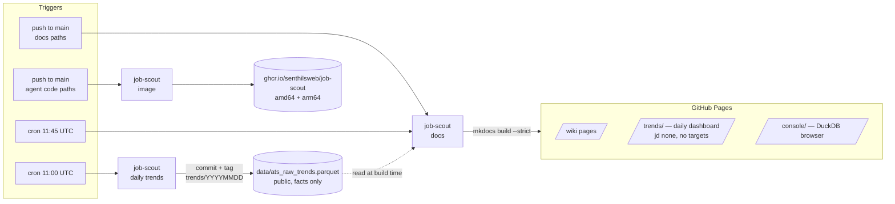

# CI/CD

At the end you will know every automated pipeline this project runs,
how they chain, and why they are split the way they are. All of them
authenticate with repo-native tokens only — no stored secrets.

## The whole chain, left to right

## The three workflows

**[job-scout daily trends](https://github.com/senthilsweb/ai-agents/blob/main/.github/workflows/job-scout-trends.yml)**
(cron 11:00 UTC + manual). Fetches every configured job board,
exports the facts-only parquet, overwrites the one canonical
`data/ats_raw_trends.parquet`, and tags the commit `trends/YYYYMMDD`
so any day stays fetchable by ref. Needs only the default
GITHUB_TOKEN.

**[job-scout image](https://github.com/senthilsweb/ai-agents/blob/main/.github/workflows/job-scout-image.yml)**
(push touching the agent + manual). Rebuilds the runtime image for
amd64 and arm64 and pushes `latest`, `sha-*`, and date tags to GHCR.

**[job-scout docs](https://github.com/senthilsweb/ai-agents/blob/main/.github/workflows/job-scout-docs.yml)**
(push touching docs/templates/console, cron 11:45 UTC, + manual).
Builds the wiki with `mkdocs build --strict` (a broken link fails the
build), then adds two live pages to the site before deploying:

- `/console/` — a copy of the DuckDB browser console.
- `/trends/` — the public dashboard, built fresh from the committed
  parquet with `--jd none` (no job-description text) and
  `--no-targets` (no role keywords; visitors pass `?roles=a,b,c`).

Deployment is `actions/deploy-pages` with the workflow's own OIDC
token — no `gh-pages` branch, and the built site is never committed.

## Two deliberate decouplings

**Data does not depend on the image.** The trends workflow installs
its four pip packages directly instead of running inside the Docker
image — so a broken image build can never stop the daily data
refresh. Two small dependency lists are the price of independent
failure domains.

**The chain is cron-based, not push-based.** The docs site refreshes
45 minutes after the data publish by schedule, not by trigger,
because GitHub deliberately stops commits made with the default
GITHUB_TOKEN from firing other workflows (recursion guard). A
personal access token would enable a push-chain but adds a stored
credential for no real gain; worst case today is the dashboard
serving yesterday's facts until the next cron.

## The same pattern elsewhere

[agent-job-matcher](https://github.com/senthilsweb/agent-job-matcher)
mirrors this setup with its own independent site and adds two more
workflows: semantic releases from Conventional Commits and a
CI-generated knowledge graph — see its
[Runbook](https://senthilsweb.github.io/agent-job-matcher/runbook/).

Next: [FAQ](faq.md).
