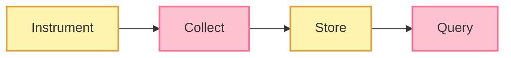
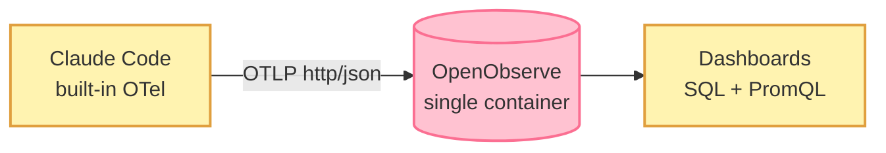

# Telemetry and Observability for Claude Code

_A hands-on setup guide — Agent Development Series_

> **Before you start:** this article assumes [Claude Code](https://code.claude.com) and [OpenObserve](https://openobserve.ai) are already installed and running (OpenObserve is a single Docker container). We focus on wiring the two together and reading what comes out.

In my previous article, [_This Cover Image Was Not Designed. It Was Orchestrated_](https://www.linkedin.com/pulse/cover-image-designed-orchestrated-senthilnathan-karuppaiah-loajc/), I shared a fully working agent — a LinkedIn cover image generator built on **Vercel's Eve agentic framework**. This article is the next step in the series: **observability**. And it doubles as a practical, step-by-step guide to setting up telemetry and observability for **Claude Code** — the AI coding environment where I build and operate these agents.

Everything I write sits under one umbrella theme: **Adaptive Data Governance**. The data world has fought these battles before — data observability, data lineage, data quality. Agents are now hitting the same wall, just faster. In upcoming sequels I will put the two side by side — **Data vs. Agent** — and show how much of the governance playbook carries over, and where agents demand new rules. This article lays the first brick: seeing what your AI tooling actually does.

## Why telemetry, and why now?

One agent that works is a demo. Ten agents doing real work is a system. And you cannot trust a system you cannot see. Telemetry gives you that sight — it turns "it seems fine" into proof. Everything that comes later stands on it:

- **Patterns and trends** — which agents run, how often, how long, and what they consume.
- **Cost control** — token and dollar spend per agent, per model, per run, before the invoice surprises you.
- **Guardrails and policy** — spotting violations (a tool call that should not happen, data leaving a boundary) needs an event stream to inspect.
- **Evals** — you cannot measure quality drift without capturing what the agent actually did.

All of that needs the same four-step plumbing:



So before wiring it into my agents (that comes in the next article — the agent is already instrumented), I started with the simplest possible subject: **my own Claude Code usage**. It gives me a working pipeline, a feel for the data, and a personal baseline — anomalies only exist relative to a baseline.

The good news: Claude Code has OpenTelemetry (OTel) support **built in**. A few environment variables and it starts emitting. No code, no wrappers, no proxies.

## Telemetry and observability vocabulary in one table

Two words this article keeps using, so let's pin them down first: **telemetry is the data** a system emits; **observability is the ability** to understand the system from that data. Telemetry is what you collect; observability is what you get. The rest of the vocabulary:

| Term | What it means | Example here |
| --- | --- | --- |
| Telemetry | All the data a system emits about itself | Everything below |
| Observability | The ability to understand a system from its telemetry | What this series is building |
| Instrument(ation) | Adding the code/config that makes a system emit telemetry | Claude Code ships pre-instrumented; we just switch it on |
| Metric | A number over time | Tokens used, dollars spent |
| Log / event | A record of one thing that happened | "Prompt submitted", "tool call accepted" |
| Trace | The full journey of one request | One agent run, end to end |
| Span | One step inside a trace | A single model call or tool execution |
| OTLP | The wire protocol OTel data travels over | What Claude Code sends |
| Exporter | The component that sends telemetry out | Claude Code's built-in OTLP exporter |
| Backend | Where telemetry is stored and queried | OpenObserve |
| Sampling | Keeping only a fraction of the data to cut volume/cost | Not needed yet at my scale |
| Baseline | What "normal" looks like, measured | My own 10-hour usage profile below |
| Anomaly | A deviation from the baseline worth investigating | A sudden cost spike, a runaway session |
| Guardrail | A rule an agent must not break, checked against telemetry | "No tool may write outside the workspace" |
| Eval | A repeatable test that scores an agent's output quality | Did the generated cover match the brief? |
| Rubric | The scoring criteria an eval uses | Layout, text accuracy, brand colors — each rated |
| Drift | Quality or behavior slowly changing over time | Eval scores trending down across versions |

For today, metrics and events are enough. Traces and spans take center stage in the next article, when one agent request fans out into dozens of model and tool calls.

## The setup: one container is enough

Claude Code speaks OTLP natively, and OpenObserve ingests OTLP natively — so Claude Code can point **directly** at OpenObserve. No OTel Collector needed in between.



> **When would you add a collector?** An OTel Collector between source and backend earns its place when you need batching and retry, fan-out to more than one backend, or filtering/redaction before storage. With a fleet of agents, that day comes. For one developer and one backend, direct is simpler — one less moving part.

Everything runs on my own machine in Docker, so nothing leaves my infrastructure. That matters, because telemetry can include prompt text if you opt in.

## Turn it on

Add these to Claude Code's `settings.json` under `env` (or export them in your shell), then restart Claude Code. The endpoint is OpenObserve's OTLP HTTP path: `/api/<org-name>`.

```json
{
  "env": {
    "CLAUDE_CODE_ENABLE_TELEMETRY": "1",
    "OTEL_METRICS_EXPORTER": "otlp",
    "OTEL_LOGS_EXPORTER": "otlp",
    "OTEL_TRACES_EXPORTER": "otlp",
    "OTEL_EXPORTER_OTLP_PROTOCOL": "http/json",
    "OTEL_EXPORTER_OTLP_ENDPOINT": "https://telemetry.example.com/api/default",
    "OTEL_EXPORTER_OTLP_HEADERS": "Authorization=Basic <redacted>",
    "OTEL_EXPORTER_OTLP_METRICS_TEMPORALITY_PREFERENCE": "delta",
    "OTEL_METRIC_EXPORT_INTERVAL": "10000",
    "OTEL_LOGS_EXPORT_INTERVAL": "5000"
  }
}
```

That's it. Within seconds, metric streams appear in OpenObserve:

- `claude_code_token_usage` — tokens, split by type (input, output, cache read, cache write) and model
- `claude_code_cost_usage` — cost in USD, per model
- `claude_code_active_time_total` — how long I was actually working
- `claude_code_lines_of_code_count`, `claude_code_code_edit_tool_decision`, session counts, and more

## My first day of numbers

**Time range:** July 6, 2026, 10:10 AM to 8:45 PM EDT — the first ~10.5 hours after I turned telemetry on. Normal work was flowing through it, including drafting this article.

| Model | Input | Output | Cache write | Cache read | Cost (USD) |
| --- | --- | --- | --- | --- | --- |
| claude-sonnet-5 | 7,866 | 95,611 | 557,915 | 19,042,603 | \$10.52 |
| claude-fable-5 | 8   | 6,827 | 25,194 | 102,396 | \$0.95 |
| claude-haiku-4.5 | 26,113 | 2,253 | 0   | 0   | \$0.04 |
| **Total** | **33,987** | **104,691** | **583,109** | **19,144,999** | **\$11.50** |

### How I got these numbers

One catch: the OpenObserve **GUI does not let you run SQL on metric streams** (the metrics page speaks PromQL). But the **search API does**. So I queried it directly:

```bash
curl -X POST "http://localhost:5080/api/default/_search?type=metrics" \
  -H "Authorization: Basic <redacted>" \
  -H "Content-Type: application/json" \
  -d '{
    "query": {
      "sql": "SELECT type, model, SUM(value) AS tokens FROM claude_code_token_usage GROUP BY type, model ORDER BY tokens DESC",
      "start_time": 1783125000000000,
      "end_time": 1783385000000000
    }
  }'
```

`start_time` and `end_time` are in **microseconds** since epoch. Same pattern for cost, just change the table to `claude_code_cost_usage`.

## What the numbers taught me

**1\. 96% of my tokens are cache reads.** Of 19.9 million tokens, 19.1 million were prompt-cache reads. This is how Claude Code works: every turn re-reads the whole conversation, and caching makes that cheap. But cheap is not free — the longer a session runs, the bigger every re-read gets. Lesson: start a fresh session when you switch tasks.

**2\. Output tokens are only 0.5% of the volume, but they drive the bill.** Output is priced several times higher than input, and far higher than cache reads. Long answers and regenerated files are where the money goes. A volume chart without cost weighting will point you at the wrong problem.

**3\. I can finally see the model mix.** Sonnet did the heavy work (\$10.52). Fable 5 was a small slice (\$0.95, from the promo window). Haiku's pattern is easy to spot — almost all input, tiny output, zero cache. Those are Claude Code's small internal helper calls running on the cheap model. Exactly the multi-model split I designed into my own agents, now visible in my own usage data.

Three insights from ten hours of data. This is the point of the baseline: I now know what _normal_ looks like for one careful human operator. When a fleet of agents starts producing the same streams, deviations from this shape — runaway sessions, cost spikes, an unusual tool-call mix — become signals instead of surprises.

## What's next

The next article: observability for the **agent itself** — traces and spans across a full run of the LinkedIn cover generator, per-run cost attribution, and the hooks that make guardrail checks and evals possible. The instrumentation is already done. See you there.

---

_If you run Claude Code, this whole setup is a handful of environment variables and one Docker container. Your own usage pattern is more interesting than you think._