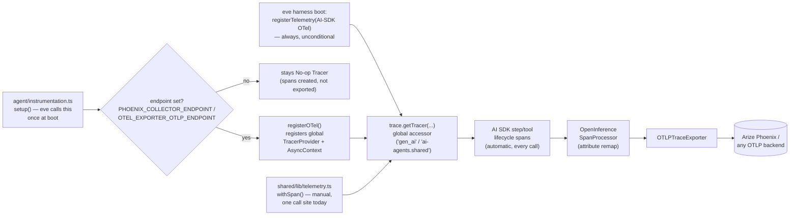

# Observability Internals

This is the technical implementation reference for
[Run with Telemetry](./run-with-telemetry.md) — how spans, attributes, and
custom signals actually get created and wired to Phoenix. There is no
decorator or code-injection magic: every span call site already exists
inside eve and the AI SDK, unconditionally, from process boot. They all
call the OpenTelemetry API's *global* tracer accessor. With no provider
registered it returns a no-op — the calls still run, but produce nothing.
`agent/instrumentation.ts` doesn't add call sites; it registers the one
real provider that turns the already-present no-ops into real, exported
spans.

## How it's wired

| Layer | What happens | Automatic? | Where it lives |
|---|---|---|---|
| A — lifecycle hooks | Model-call + tool-call spans, the whole `ai.eve.turn` tree | Always running (no-op without a provider) | eve's harness + `@ai-sdk/otel`, unconditional — not gated by this repo at all |
| B — provider registration | Real tracer provider, OTLP exporter, async context propagation | Only if `PHOENIX_COLLECTOR_ENDPOINT` / `OTEL_EXPORTER_OTLP_ENDPOINT` is set | `shared/lib/instrumentation.ts` → `registerOTel()` |
| C — attribute mapping | `ai.*` (AI SDK) → OpenInference semantic conventions, so Phoenix renders LLM traces | Automatic once B is on | `OpenInferenceSimpleSpanProcessor` (`@arizeai/openinference-vercel`) |
| D — custom attributes | `eve.*` + our `cover.orchestrator_model` / `cover.image_model` land on spans | Automatic once B is on | `events["step.started"]` → AI SDK `runtimeContext` |
| E — custom spans | One-off spans for code the AI SDK can't see (e.g. a raw `fetch`) | Manual call site; auto-nests, auto-no-ops | `shared/lib/telemetry.ts` (`withSpan`, `logEvent`) |
| F — metrics | `counter()` / `histogram()` | Calls are safe now; **export unwired** — no `MeterProvider` registered yet | `shared/lib/telemetry.ts`; follow-up work |

**Why nesting "just works":** `registerOTel()` (layer B) also installs an
AsyncLocalStorage-based context manager — the piece that threads "which
span is active" across `await` boundaries. A custom span opened inside a
tool's `execute()` (layer E) picks up that tool's already-active context
automatically and parents itself underneath — no parent id passed
anywhere, by either eve or us.

**Why zero per-tool code changes were needed:** every orchestrator tool
call (`create_run`, `load_input`, `generate_image`, `validate_image`, …)
already gets a span for free from layer A. The one place we wrote a manual
span (`generate_image`'s image-API `fetch`) exists to go **one level
deeper** than that free tool-call span — isolating the network call's
latency from any other work the tool does.

## Stream-event vocabulary (`agent/hooks/*.ts`)

This is the general-purpose observability surface — audit logging,
metrics, persistence — independent of OpenTelemetry. A hook (`defineHook`
from `eve/hooks`) subscribes to any of these under an `events` map (`*`
matches every event); the shared usage hook
(`shared/hooks/usage.ts`) is a live example, subscribing to
`step.completed` and `turn.completed`.

| Event | Meaning |
|---|---|
| `session.started` | A durable session was created |
| `turn.started` | A new turn began |
| `message.received` | An inbound user message was accepted |
| `step.started` | A model step began |
| `actions.requested` | The model requested tool calls |
| `action.result` | A tool call returned |
| `input.requested` | The run paused for human input (HITL approval / `ask_question`) |
| `subagent.called` | A subagent was delegated; carries `childSessionId` |
| `subagent.completed` | A delegated subagent finished |
| `reasoning.appended` | A reasoning delta (incremental, cumulative text so far) |
| `reasoning.completed` | The finalized reasoning block |
| `message.appended` | An assistant text delta (incremental, cumulative text so far) |
| `message.completed` | A finalized assistant text block — can fire more than once per turn |
| `result.completed` | Finalized structured result for a turn with an output schema |
| `compaction.requested` | Context-window compaction began |
| `compaction.completed` | A compaction checkpoint was written to durable history |
| `authorization.required` | A connection needs OAuth |
| `authorization.completed` | A connection's authorization resolved |
| `step.completed` | A model step finished — carries `finishReason` and usage |
| `step.failed` | A model step failed — carries `{ code, message, details? }` |
| `turn.completed` | The turn finished |
| `turn.failed` | The turn failed |
| `session.waiting` | The session parked, waiting for the next input |
| `session.failed` | The session failed (terminal) |
| `session.completed` | The session reached a terminal end |

**Execution order per event:** channel handler → metadata projection →
hooks (typed handlers, then `*`) → dynamic tool/skill/instruction
resolvers. Hooks fire only after the event is durably recorded, and
handlers are observe-only (they cannot inject model context — use
`defineDynamic/defineInstructions` for that). A thrown hook surfaces as
`turn.failed` (or escalates to `session.failed` if it throws again on that
cascade).

## Instrumentation events (`agent/instrumentation.ts`)

A much narrower, OTel-specific surface — this is what
`createAgentInstrumentation()` (`shared/lib/instrumentation.ts`) actually
uses.

| Hook / field | Fires | Purpose |
|---|---|---|
| `setup({ agentName })` | Once, at server startup | Register the OTel provider (`registerOTel`) |
| `events["step.started"](input)` | Before each model-call attempt, after eve assembles the input | Return `{ runtimeContext }` to attach custom attributes to that step's spans |
| `recordInputs` | N/A (a setting, not an event) | Whether full model inputs are recorded on spans (default `true`) |
| `recordOutputs` | N/A (a setting, not an event) | Whether full model outputs are recorded on spans (default `true`) |
| `functionId` | N/A (a setting, not an event) | Overrides the function name on spans (defaults to the agent name) |

`events["step.started"]` receives `channel`, `modelInput`, `session`,
`step`, and `turn` — see `shared/lib/instrumentation.ts`'s
`AgentInstrumentationOptions.attributes` callback for how this agent uses
it (env reads only, no I/O, no throw path).

## Where this repo's code sits

| File | Layer | Role |
|---|---|---|
| `shared/lib/instrumentation.ts` | B, D | `createAgentInstrumentation()` — provider registration + attribute callback |
| `shared/lib/telemetry.ts` | E, F | `withSpan`, `logEvent`, `counter`, `histogram` — need-basis custom signals |
| `agent/instrumentation.ts` | B, D (adoption) | Per-agent ~5-line wrapper passing `cover.*` attributes |
| `agent/tools/generate_image.ts` | E (adoption) | The one custom-span call site (`cover.image_generation`) |
| `shared/hooks/usage.ts` | separate surface | Token-usage rollup via `step.completed` / `turn.completed` hooks (not OTel) |

See [Run with Telemetry](./run-with-telemetry.md) for the operational
guide (env vars, Phoenix setup, privacy toggles, adopting this in another
agent).
