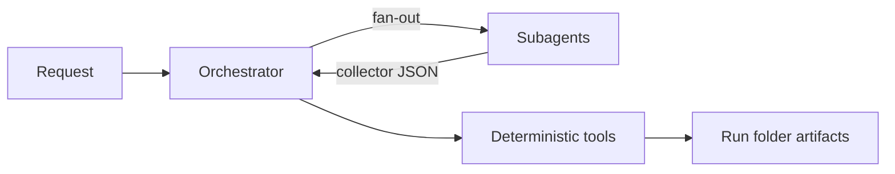

# Architecture

A concise overview of how the `ai-agents` monorepo is wired. For the *why*
behind specific decisions, see the ADRs under [`openspec/adr/`](../openspec/adr).

## Monorepo layout

```text
ai-agents/
├── agents/<name>/        # one Eve agent per folder (self-contained)
│   ├── agent/
│   │   ├── instructions.md     # orchestrator system prompt
│   │   ├── tools/*.ts          # deterministic typed tools
│   │   ├── subagents/*/        # scoped subagents (own tools + prompt)
│   │   ├── hooks/*.ts          # lifecycle hooks (e.g. usage accounting)
│   │   ├── schedules/*.md      # optional cron-style triggers
│   │   └── sandbox/            # sandbox factory + workspace/runs/
│   ├── .env.example
│   └── README.md
├── shared/               # Shared Agent Runtime Kit (workspace package)
└── docs/ARCHITECTURE.md
```

Eve is **filesystem-first**: tools are auto-discovered from `agent/tools/*.ts`
(tool name = file slug), hooks from `agent/hooks/*.ts`, subagents from
`agent/subagents/*/`. There is no central registration file.

## Shared Agent Runtime Kit (`shared/`)

`shared/` is a workspace package that every agent depends on (`"shared": "*"`)
and imports by **package subpath** — `import { x } from "shared/lib/x.js"`.

> Intra-`shared` imports between siblings must also use the package subpath
> (`shared/lib/x.js`), never a bare relative path (`../lib/x.js`). Eve's
> dev-runtime snapshot tracer follows the `exports` map and dependency
> symlinks, not bare relative imports; relative siblings typecheck but fail at
> runtime with `LoadCompiledModuleMapError`.

What it provides:

| Area | Module | Responsibility |
|---|---|---|
| Model resolution | `shared/lib/model.js` | Agnostic, per-role: `MODEL_<ROLE>_*` → `MODEL_*`. No default model id. |
| Run folder | `shared/lib/run.js` | `writeRunArtifact` mirrors files to host + sandbox; create/resolve run ids. |
| Host sync | `shared/tools/sync_run_to_host.js` | Canonical end-of-run copy of the run folder to `HOST_REPORT_ROOT`. |
| Usage + cost | `shared/hooks/usage.js`, `shared/lib/summary.js`, `shared/cost/rates.yaml` | Accumulate token usage; build `summary.json` with estimated cost. |
| Sandbox | `shared/lib/sandbox-cleanup.js`, `shared/tools/cleanup_sandbox.js` | Reap stopped `eve-sbx-*` containers; never touches running ones. |

## Agent pattern

An agent is an **orchestrator** (reasoning-class model, driven by
`instructions.md`) plus one or more **subagents** (fast non-reasoning models)
that fan out work. All side effects happen in deterministic typed tools, so
the LLM only decides *what* to run, not *how* the output is shaped.



## Run lifecycle (github-pr-digest)

```text
create_run            # new run folder; sweep stale stopped sandbox containers
  └─ repository-scout × N   # one subagent per repo → repositories/<owner>__<repo>.json
render_and_save_report      # flatten → pull_requests/pr_reviews/pr_comments (jsonl+csv), render report.md, write summary.json
sync_run_to_host            # copy the whole run folder back to the host
cleanup_sandbox             # reap this run's now-stopped scout containers
```

Each Eve session (orchestrator and every subagent) runs in its own
`eve-sbx-*` Docker container. Containers are reaped only once stopped — the
next run's `create_run` sweep collects the orchestrator's own container after
it exits.

## Data model: data is the source of truth

The report is never authored directly. A run produces a **flat, scalar-only
dataset** and the human-readable report is rendered *from* it, so the two can
never drift:

```text
repositories/<owner>__<repo>.json   # raw per-repo collector capture (nested)
        │  flatten
        ▼
pull_requests.{jsonl,csv}   # one row per PR — DB-ready
pr_reviews.{jsonl,csv}      # one row per review/approval action
pr_comments.{jsonl,csv}     # one row per comment (issue + inline), with body
        │  group + render
        ▼
report.md                                   # human digest
summary.json                                # run metrics (tokens + cost)
```

`pull_requests` columns: `run_id, generated_at, from_date, to_date, repository,
owner, repo, number, title, url, state, draft, author, created_at, updated_at,
closed_at, merged_at, merged_by, approved_by, approved_at, head_sha,
merge_commit_sha, commit_count, comment_count, review_comment_count, additions,
deletions, changed_files, events`. Every value is a scalar, so the dataset
imports directly into any relational or columnar store and re-renders
deterministically. `pr_reviews` and `pr_comments` are child tables keyed by
`pr_number` for full approval and discussion fidelity.
